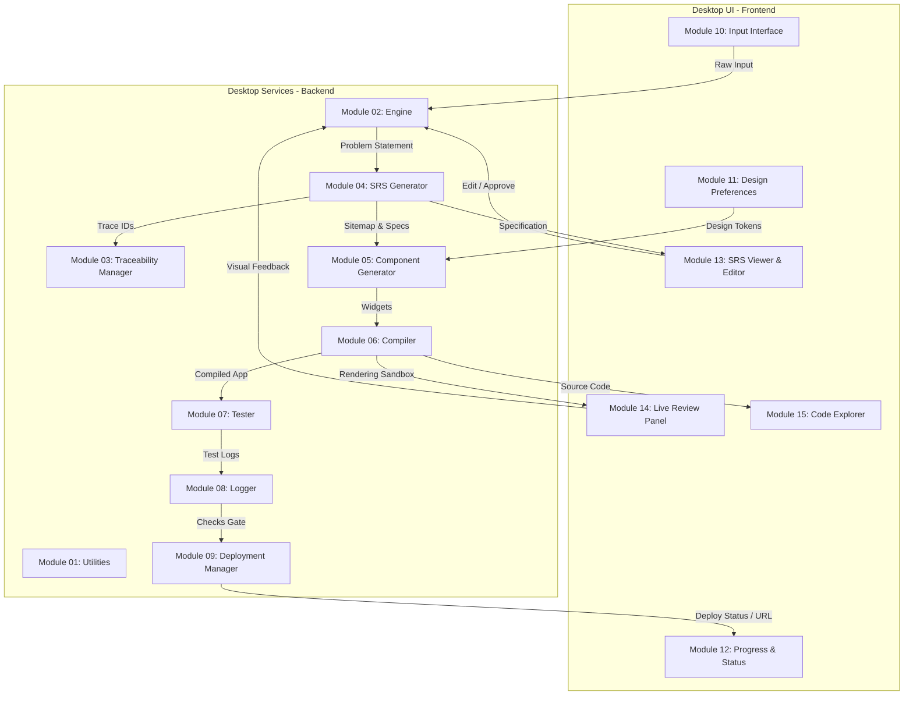

# Architecture & System Design

This document details the components and pipeline design of the **Jinie Desktop Application**.

---

## High-Level Architecture

---

## System Component Mappings

### 1. Frontend Client Components

* **Input Interface (Module 10)**: Intake interface capturing freeform typing, speech prompts, and reference documents.
* **Design Preferences Panel (Module 11)**: Token picker managing swatch selections, fonts, layouts, and active themes.
* **Progress and Status Panel (Module 12)**: Stepper indicating backend compilation phases and live log screens.
* **SRS Viewer and Editor (Module 13)**: Grid view displaying requirements, inline editors, and check-boxes for requirements validation.
* **Live Review Panel (Module 14)**: Sandbox framing isolated components or interactive screen previews.
* **Code Explorer (Module 15)**: Directory navigation and ZIP packaging exporters.

---

### 2. Backend Services Pipeline

* **Utilities (Module 01)**: Shared low-level file handler operations, Markdown parsers, style formatters, stack installation scripts, and Verification & Validation checkpoints.
* **Engine (Module 02)**: Main supervisor driving execution states, translating prompt variables, and routing user suggestions back to active pipelines.
* **Traceability Manager (Module 03)**: Encodes hierarchy linkages between sitemaps, components, code lines, and specifications using trace matrix indices.
* **SRS Generator (Module 04)**: NLP engine breaking prompt parameters into functional specifications and stack requirements.
* **Component Generator (Module 05)**: Synthesizes design tokens and layouts into code files.
* **Compiler (Module 06)**: Glues widgets, state, assets, and configs together into a standard Flutter codebase structure.
* **Tester (Module 07)**: Checks logic endpoints against requirement behaviors.
* **Logger (Module 08)**: Publishes activity logs and performs safety checks (boot validation, login checks) prior to release.
* **Deployment Manager (Module 09)**: Compiles production bundles and posts assets live to Firebase Hosting.
